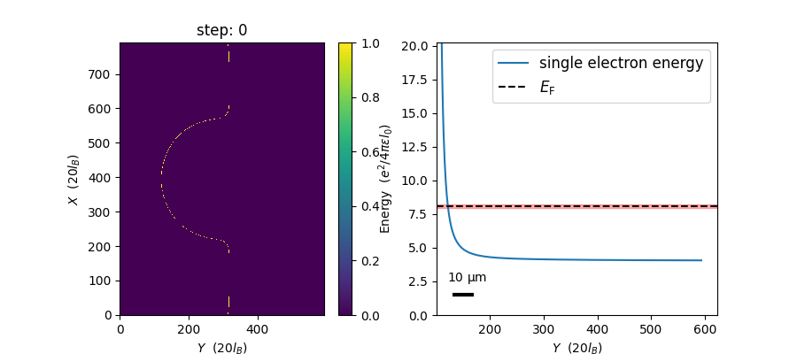

# edgecraft



## Installing

- Python: ^3.10

1. Download the repository as a zipped file and decompress the file.
2. Move to the root directory and run the installation code.
   ```sh
   $ python -m pip install .
   ```

## Setup for development

1. Install Python 3.10.x.
2. Install [poetry](https://python-poetry.org/docs/).
3. Install the dependencies:
    ```sh
    $ poetry install
    ```
## Running
   You rin the program as follows
   $ python click_application.py your_config_file.py
   This will run the simulation (or whatever aspects of the simulation can be run with objects in your config file)

## Config file
   Your config file dictates many of the parameters of the simulation. In needs to contain these specifications:
   - space_matrix (np.ndarray, optional): 2D array of points. Represents the space your chip occupies.
   - etchings (np.ndarray, optional): a 3D array. Elements of which are matricies of the same shape as space_matrix with a 1 if it is included in the etching and a 0 if it isn't
   - etching_potentials (np.ndarray, optional): a 1D array. Each entry here corresponds to the strength of the potential induced by the corresponding etching. Should have the same first dimension as etchings
   - etching_energy (np.ndarray, optional): a 2D array of the energy induced by etchings. This is equivalent to inputting etchings and etching_potentials
   - boundary_indices (np.ndarray): a 2d array. Contains coorinates of the edge of the chip
   - bulk_indices (np.ndarray): a 2D array. Contains coorinates of the bulk of the chip (that's not vaccum or boundary)
   - desired_scale_factor(np.ndarray): 1D array of the desired scale factor at various points in time. The simulation will output the voltage required for the desired scale factor at each corresponding point in time.