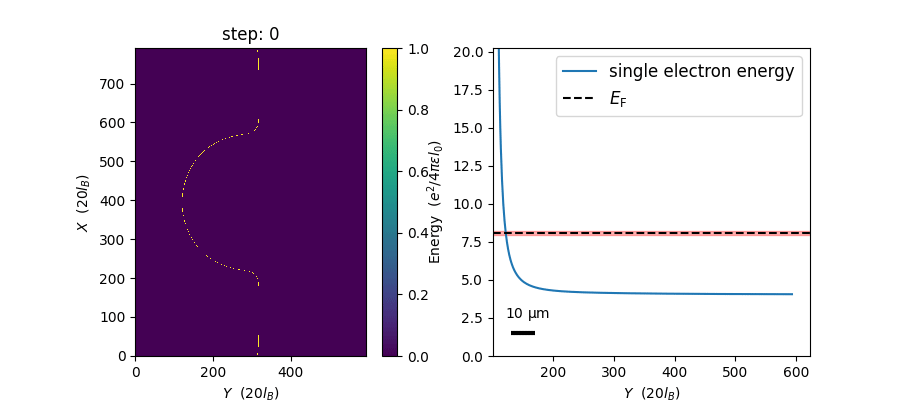

# edgecraft



## Installing

- Python: ^3.10

1. Download the repository as a zipped file and decompress the file.
2. Move to the root directory and run the installation code.
   ```sh
   $ python -m pip install .
   ```

## Setup for development

1. Install Python 3.10.x.
2. Install [poetry](https://python-poetry.org/docs/).
3. Install the dependencies:
    ```sh
    $ poetry install
    ```
