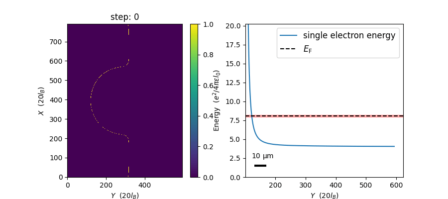

# edgecraft

## Installing

- Python: ^3.10

```sh
$ pip install git+https://github.com/Quantum-Dynamics/edgecraft.git
```

## Setup for development

1. Install Python 3.10.x.
2. Install [poetry](https://python-poetry.org/docs/).
3. Install the dependencies:
    ```sh
    $ poetry install
    ```

## Examples

### Simple Sample

- This example simulates a simple sample with homogeneous mesa and a metal gate that applies a time-dependent potential to the sample.
- [simple_sample.py](https://github.com/Quantum-Dynamics/edgecraft/tree/main/examples/simple_sample/simple_sample.py)
  - Outputs the simulation result as npy files of edge lengths and gate potential applied.
- [simple_sample_anim.py](https://github.com/Quantum-Dynamics/edgecraft/tree/main/examples/simple_sample/simple_sample.py)
  - Outputs the simulation result as a gif animation of the edge expansion.



### Multiple Etched Sample

- This example simulates a sample with multiple etchings and a metal gate that applies a time-dependent potential to the sample.
- [multiple_etched_sample.py](https://github.com/Quantum-Dynamics/edgecraft/tree/main/examples/multiple_etched_sample/multiple_etched_sample.py)
  - Outputs the simulation result as npy files of edge lengths and gate potential applied.
- [multiple_etched_sample_anim.py](https://github.com/Quantum-Dynamics/edgecraft/tree/main/examples/multiple_etched_sample/multiple_etched_sample.py)
  - Outputs the simulation result as a gif animation of the edge expansion.


